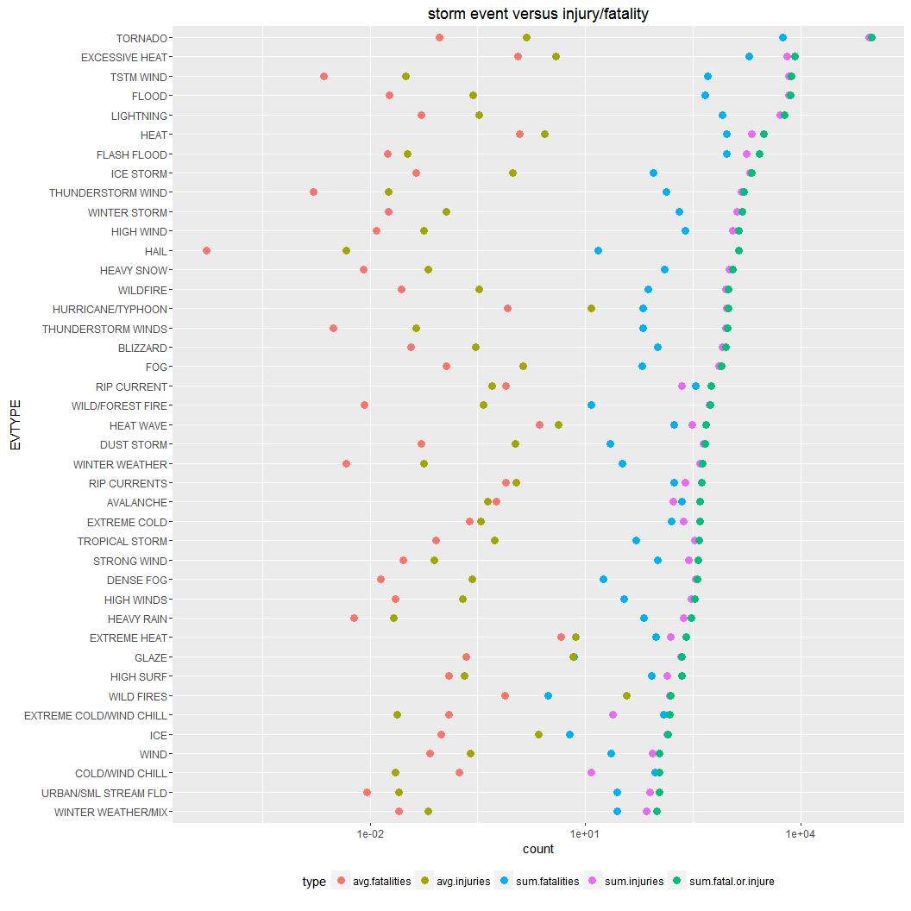

# NOAA Stormdata Tracking between 1950-2011

## Synopsis

In this report we are analyzing the U.S. National Oceanic and Atmospheric Administration's (NOAA) storm database.  The database has tracking for events in the US 50 states as well as 22 other locations like US territorities  (e.g. Guam, American Samoa).  Tornados, heat, and wind are the top 3 events that measured the highest number of combined injuries + fatalities.  We combined injuries and fatalities into a single metric to determine the ranking.  Extreme heat-related events appear to 

## Loading and Processing the Data


```r
library(lubridate)
library(ggplot2)
library(dplyr)
```

```
## 
## Attaching package: 'dplyr'
## 
## The following objects are masked from 'package:lubridate':
## 
##     intersect, setdiff, union
## 
## The following objects are masked from 'package:stats':
## 
##     filter, lag
## 
## The following objects are masked from 'package:base':
## 
##     intersect, setdiff, setequal, union
```

```r
library(data.table)
```

```
## 
## Attaching package: 'data.table'
## 
## The following objects are masked from 'package:dplyr':
## 
##     between, last
## 
## The following objects are masked from 'package:lubridate':
## 
##     hour, mday, month, quarter, wday, week, yday, year
```

```r
library(tidyr)
```

```
## Warning: package 'tidyr' was built under R version 3.2.3
```

```r
library(knitr)
## loading for US State Facts and Figures
library(datasets)

## output wider graphs
opts_chunk$set(dev = 'png')
##opts_chunk$set(out.width='750px', dpi=200)

if (!file.exists("./data")) {
    dir.create("./data")
}
```

Download, unzip, and read in the data.  This was done on Windows7 OS, so downloaded in 'wb' mode.


```r
fileurl <- "https://d396qusza40orc.cloudfront.net/repdata%2Fdata%2FStormData.csv.bz2"
download.file(fileurl, destfile = "./data/repdata%2Fdata%2FStormData.csv.bz2", mode = 'wb')

data <- read.csv("./data/repdata%2Fdata%2FStormData.csv.bz2", stringsAsFactors = FALSE)
```

Take a preliminary look at the data.


```r
str(data)
```

```
## 'data.frame':	902297 obs. of  37 variables:
##  $ STATE__   : num  1 1 1 1 1 1 1 1 1 1 ...
##  $ BGN_DATE  : chr  "4/18/1950 0:00:00" "4/18/1950 0:00:00" "2/20/1951 0:00:00" "6/8/1951 0:00:00" ...
##  $ BGN_TIME  : chr  "0130" "0145" "1600" "0900" ...
##  $ TIME_ZONE : chr  "CST" "CST" "CST" "CST" ...
##  $ COUNTY    : num  97 3 57 89 43 77 9 123 125 57 ...
##  $ COUNTYNAME: chr  "MOBILE" "BALDWIN" "FAYETTE" "MADISON" ...
##  $ STATE     : chr  "AL" "AL" "AL" "AL" ...
##  $ EVTYPE    : chr  "TORNADO" "TORNADO" "TORNADO" "TORNADO" ...
##  $ BGN_RANGE : num  0 0 0 0 0 0 0 0 0 0 ...
##  $ BGN_AZI   : chr  "" "" "" "" ...
##  $ BGN_LOCATI: chr  "" "" "" "" ...
##  $ END_DATE  : chr  "" "" "" "" ...
##  $ END_TIME  : chr  "" "" "" "" ...
##  $ COUNTY_END: num  0 0 0 0 0 0 0 0 0 0 ...
##  $ COUNTYENDN: logi  NA NA NA NA NA NA ...
##  $ END_RANGE : num  0 0 0 0 0 0 0 0 0 0 ...
##  $ END_AZI   : chr  "" "" "" "" ...
##  $ END_LOCATI: chr  "" "" "" "" ...
##  $ LENGTH    : num  14 2 0.1 0 0 1.5 1.5 0 3.3 2.3 ...
##  $ WIDTH     : num  100 150 123 100 150 177 33 33 100 100 ...
##  $ F         : int  3 2 2 2 2 2 2 1 3 3 ...
##  $ MAG       : num  0 0 0 0 0 0 0 0 0 0 ...
##  $ FATALITIES: num  0 0 0 0 0 0 0 0 1 0 ...
##  $ INJURIES  : num  15 0 2 2 2 6 1 0 14 0 ...
##  $ PROPDMG   : num  25 2.5 25 2.5 2.5 2.5 2.5 2.5 25 25 ...
##  $ PROPDMGEXP: chr  "K" "K" "K" "K" ...
##  $ CROPDMG   : num  0 0 0 0 0 0 0 0 0 0 ...
##  $ CROPDMGEXP: chr  "" "" "" "" ...
##  $ WFO       : chr  "" "" "" "" ...
##  $ STATEOFFIC: chr  "" "" "" "" ...
##  $ ZONENAMES : chr  "" "" "" "" ...
##  $ LATITUDE  : num  3040 3042 3340 3458 3412 ...
##  $ LONGITUDE : num  8812 8755 8742 8626 8642 ...
##  $ LATITUDE_E: num  3051 0 0 0 0 ...
##  $ LONGITUDE_: num  8806 0 0 0 0 ...
##  $ REMARKS   : chr  "" "" "" "" ...
##  $ REFNUM    : num  1 2 3 4 5 6 7 8 9 10 ...
```

```r
head(data)
```

```
##   STATE__           BGN_DATE BGN_TIME TIME_ZONE COUNTY COUNTYNAME STATE
## 1       1  4/18/1950 0:00:00     0130       CST     97     MOBILE    AL
## 2       1  4/18/1950 0:00:00     0145       CST      3    BALDWIN    AL
## 3       1  2/20/1951 0:00:00     1600       CST     57    FAYETTE    AL
## 4       1   6/8/1951 0:00:00     0900       CST     89    MADISON    AL
## 5       1 11/15/1951 0:00:00     1500       CST     43    CULLMAN    AL
## 6       1 11/15/1951 0:00:00     2000       CST     77 LAUDERDALE    AL
##    EVTYPE BGN_RANGE BGN_AZI BGN_LOCATI END_DATE END_TIME COUNTY_END
## 1 TORNADO         0                                               0
## 2 TORNADO         0                                               0
## 3 TORNADO         0                                               0
## 4 TORNADO         0                                               0
## 5 TORNADO         0                                               0
## 6 TORNADO         0                                               0
##   COUNTYENDN END_RANGE END_AZI END_LOCATI LENGTH WIDTH F MAG FATALITIES
## 1         NA         0                      14.0   100 3   0          0
## 2         NA         0                       2.0   150 2   0          0
## 3         NA         0                       0.1   123 2   0          0
## 4         NA         0                       0.0   100 2   0          0
## 5         NA         0                       0.0   150 2   0          0
## 6         NA         0                       1.5   177 2   0          0
##   INJURIES PROPDMG PROPDMGEXP CROPDMG CROPDMGEXP WFO STATEOFFIC ZONENAMES
## 1       15    25.0          K       0                                    
## 2        0     2.5          K       0                                    
## 3        2    25.0          K       0                                    
## 4        2     2.5          K       0                                    
## 5        2     2.5          K       0                                    
## 6        6     2.5          K       0                                    
##   LATITUDE LONGITUDE LATITUDE_E LONGITUDE_ REMARKS REFNUM
## 1     3040      8812       3051       8806              1
## 2     3042      8755          0          0              2
## 3     3340      8742          0          0              3
## 4     3458      8626          0          0              4
## 5     3412      8642          0          0              5
## 6     3450      8748          0          0              6
```

```r
summary(data)
```

```
##     STATE__       BGN_DATE           BGN_TIME          TIME_ZONE        
##  Min.   : 1.0   Length:902297      Length:902297      Length:902297     
##  1st Qu.:19.0   Class :character   Class :character   Class :character  
##  Median :30.0   Mode  :character   Mode  :character   Mode  :character  
##  Mean   :31.2                                                           
##  3rd Qu.:45.0                                                           
##  Max.   :95.0                                                           
##                                                                         
##      COUNTY       COUNTYNAME           STATE              EVTYPE         
##  Min.   :  0.0   Length:902297      Length:902297      Length:902297     
##  1st Qu.: 31.0   Class :character   Class :character   Class :character  
##  Median : 75.0   Mode  :character   Mode  :character   Mode  :character  
##  Mean   :100.6                                                           
##  3rd Qu.:131.0                                                           
##  Max.   :873.0                                                           
##                                                                          
##    BGN_RANGE          BGN_AZI           BGN_LOCATI       
##  Min.   :   0.000   Length:902297      Length:902297     
##  1st Qu.:   0.000   Class :character   Class :character  
##  Median :   0.000   Mode  :character   Mode  :character  
##  Mean   :   1.484                                        
##  3rd Qu.:   1.000                                        
##  Max.   :3749.000                                        
##                                                          
##    END_DATE           END_TIME           COUNTY_END COUNTYENDN    
##  Length:902297      Length:902297      Min.   :0    Mode:logical  
##  Class :character   Class :character   1st Qu.:0    NA's:902297   
##  Mode  :character   Mode  :character   Median :0                  
##                                        Mean   :0                  
##                                        3rd Qu.:0                  
##                                        Max.   :0                  
##                                                                   
##    END_RANGE          END_AZI           END_LOCATI       
##  Min.   :  0.0000   Length:902297      Length:902297     
##  1st Qu.:  0.0000   Class :character   Class :character  
##  Median :  0.0000   Mode  :character   Mode  :character  
##  Mean   :  0.9862                                        
##  3rd Qu.:  0.0000                                        
##  Max.   :925.0000                                        
##                                                          
##      LENGTH              WIDTH                F               MAG         
##  Min.   :   0.0000   Min.   :   0.000   Min.   :0.0      Min.   :    0.0  
##  1st Qu.:   0.0000   1st Qu.:   0.000   1st Qu.:0.0      1st Qu.:    0.0  
##  Median :   0.0000   Median :   0.000   Median :1.0      Median :   50.0  
##  Mean   :   0.2301   Mean   :   7.503   Mean   :0.9      Mean   :   46.9  
##  3rd Qu.:   0.0000   3rd Qu.:   0.000   3rd Qu.:1.0      3rd Qu.:   75.0  
##  Max.   :2315.0000   Max.   :4400.000   Max.   :5.0      Max.   :22000.0  
##                                         NA's   :843563                    
##    FATALITIES          INJURIES            PROPDMG       
##  Min.   :  0.0000   Min.   :   0.0000   Min.   :   0.00  
##  1st Qu.:  0.0000   1st Qu.:   0.0000   1st Qu.:   0.00  
##  Median :  0.0000   Median :   0.0000   Median :   0.00  
##  Mean   :  0.0168   Mean   :   0.1557   Mean   :  12.06  
##  3rd Qu.:  0.0000   3rd Qu.:   0.0000   3rd Qu.:   0.50  
##  Max.   :583.0000   Max.   :1700.0000   Max.   :5000.00  
##                                                          
##   PROPDMGEXP           CROPDMG         CROPDMGEXP       
##  Length:902297      Min.   :  0.000   Length:902297     
##  Class :character   1st Qu.:  0.000   Class :character  
##  Mode  :character   Median :  0.000   Mode  :character  
##                     Mean   :  1.527                     
##                     3rd Qu.:  0.000                     
##                     Max.   :990.000                     
##                                                         
##      WFO             STATEOFFIC         ZONENAMES            LATITUDE   
##  Length:902297      Length:902297      Length:902297      Min.   :   0  
##  Class :character   Class :character   Class :character   1st Qu.:2802  
##  Mode  :character   Mode  :character   Mode  :character   Median :3540  
##                                                           Mean   :2875  
##                                                           3rd Qu.:4019  
##                                                           Max.   :9706  
##                                                           NA's   :47    
##    LONGITUDE        LATITUDE_E     LONGITUDE_       REMARKS         
##  Min.   :-14451   Min.   :   0   Min.   :-14455   Length:902297     
##  1st Qu.:  7247   1st Qu.:   0   1st Qu.:     0   Class :character  
##  Median :  8707   Median :   0   Median :     0   Mode  :character  
##  Mean   :  6940   Mean   :1452   Mean   :  3509                     
##  3rd Qu.:  9605   3rd Qu.:3549   3rd Qu.:  8735                     
##  Max.   : 17124   Max.   :9706   Max.   :106220                     
##                   NA's   :40                                        
##      REFNUM      
##  Min.   :     1  
##  1st Qu.:225575  
##  Median :451149  
##  Mean   :451149  
##  3rd Qu.:676723  
##  Max.   :902297  
## 
```

This was moderately helpful, we are interested in health and economic impacts by events.  I see the columns of interest.

Let's start to explore the data in the columns, here are some basic questions I have.


```r
length(unique(data$EVTYPE)) -> disaster.type.count
range(data$FATALITIES) -> max.death.count
range(data$INJURIES) -> max.injury.count

length(unique(data$STATE)) -> states.impacted.count
unique(data$STATE) -> states.impacted
setdiff(states.impacted, state.abb) -> impacted.outside.50.states
```

There are 22 locations outside the US 50 states that are included in this data set.  I see Guam, Puerto Rico, Virgin Islands....several others I don't recognize, immediately.  For this analysis we are asked to look at just the United States, which means I will need to remove all of the extra locations in the data, rather than filter just for U.S.  "DC" appears to be Washington, DC, so I will include that one.

convert from data.frame to my preferred data.table.


```r
dt_data <- data.table(data)

## check for NA values
na.rows.injuries <- sum(is.na(dt_data$INJURIES))
na.rows.deaths <- sum(is.na(dt_data$FATALITIES))
```

There are no NA rows....good!

## Health impact analysis

Calculate: 
--Remove non-US states.  Keep Washington, DC.
--The total sum and averages of deaths and injuries by event type.
--Also calculate a total sum of fatal+injure by event type.


```r
impacted.outside.50.states.no.DC <- impacted.outside.50.states[!impacted.outside.50.states %in% 
                                                 "DC"]

dt_data_nonUS_removed <- dt_data[which(!dt_data$STATE %in% 
                                           impacted.outside.50.states.no.DC),]

dt_data_sums <- dt_data_nonUS_removed[,.(sum.fatalities=sum(FATALITIES),
                                         avg.fatalities=mean(FATALITIES),
                                          sum.injuries=sum(INJURIES), avg.injuries=mean(INJURIES),
                                          sum.fatal.or.injure=sum(FATALITIES,INJURIES)),
                                       by=EVTYPE][order(-sum.fatal.or.injure)][sum.fatal.or.injure >= 100]

dt_data_sums
```

```
##                      EVTYPE sum.fatalities avg.fatalities sum.injuries
##  1:                 TORNADO           5633   9.289861e-02        91346
##  2:          EXCESSIVE HEAT           1903   1.134088e+00         6525
##  3:               TSTM WIND            504   2.292034e-03         6956
##  4:                   FLOOD            464   1.858379e-02         6786
##  5:               LIGHTNING            806   5.132450e-02         5224
##  6:                    HEAT            937   1.221643e+00         2100
##  7:             FLASH FLOOD            939   1.761131e-02         1769
##  8:               ICE STORM             89   4.436690e-02         1975
##  9:       THUNDERSTORM WIND            133   1.611672e-03         1481
## 10:            WINTER STORM            206   1.801802e-02         1321
## 11:               HIGH WIND            248   1.228574e-02         1134
## 12:                    HAIL             15   5.196911e-05         1361
## 13:              HEAVY SNOW            127   8.085052e-03         1021
## 14:                WILDFIRE             75   2.744237e-02          911
## 15:       HURRICANE/TYPHOON             63   8.181818e-01          922
## 16:      THUNDERSTORM WINDS             64   3.074706e-03          908
## 17:                BLIZZARD            101   3.714601e-02          805
## 18:                     FOG             62   1.152416e-01          734
## 19:             RIP CURRENT            343   7.795455e-01          222
## 20:        WILD/FOREST FIRE             12   8.298755e-03          544
## 21:               HEAT WAVE            172   2.324324e+00          309
## 22:              DUST STORM             22   5.225653e-02          440
## 23:          WINTER WEATHER             33   4.696840e-03          398
## 24:            RIP CURRENTS            175   7.743363e-01          249
## 25:               AVALANCHE            224   5.803109e-01          170
## 26:            EXTREME COLD            160   2.442748e-01          231
## 27:          TROPICAL STORM             51   8.212560e-02          338
## 28:             STRONG WIND            103   2.908783e-02          277
## 29:               DENSE FOG             18   1.392111e-02          342
## 30:              HIGH WINDS             35   2.284595e-02          302
## 31:              HEAVY RAIN             66   6.045617e-03          233
## 32:            EXTREME HEAT             96   4.571429e+00          155
## 33:               HIGH SURF             84   1.240768e-01          139
## 34:                   GLAZE              7   2.187500e-01          216
## 35:              WILD FIRES              3   7.500000e-01          150
## 36: EXTREME COLD/WIND CHILL            125   1.247505e-01           24
## 37:                     ICE              6   9.836066e-02          137
## 38:                    WIND             23   6.764706e-02           86
## 39:    URBAN/SML STREAM FLD             28   9.043928e-03           79
## 40:         COLD/WIND CHILL             95   1.762523e-01           12
## 41:      WINTER WEATHER/MIX             28   2.536232e-02           72
##                      EVTYPE sum.fatalities avg.fatalities sum.injuries
##     avg.injuries sum.fatal.or.injure
##  1:  1.506464806               96979
##  2:  3.888557807                8428
##  3:  0.031633711                7460
##  4:  0.271787888                7250
##  5:  0.332654101                6030
##  6:  2.737940026                3037
##  7:  0.033178289                2708
##  8:  0.984546361                2064
##  9:  0.017946512                1614
## 10:  0.115542727                1527
## 11:  0.056177549                1382
## 12:  0.004715331                1376
## 13:  0.064998727                1148
## 14:  0.333333333                 986
## 15: 11.974025974                 985
## 16:  0.043622388                 972
## 17:  0.296064730                 906
## 18:  1.364312268                 796
## 19:  0.504545455                 565
## 20:  0.376210235                 556
## 21:  4.175675676                 481
## 22:  1.045130641                 462
## 23:  0.056646741                 431
## 24:  1.101769912                 424
## 25:  0.440414508                 394
## 26:  0.352671756                 391
## 27:  0.544283414                 389
## 28:  0.078226490                 380
## 29:  0.264501160                 360
## 30:  0.197127937                 337
## 31:  0.021342860                 299
## 32:  7.380952381                 251
## 33:  0.205317578                 223
## 34:  6.750000000                 223
## 35: 37.500000000                 153
## 36:  0.023952096                 149
## 37:  2.245901639                 143
## 38:  0.252941176                 109
## 39:  0.025516796                 107
## 40:  0.022263451                 107
## 41:  0.065217391                 100
##     avg.injuries sum.fatal.or.injure
```

I filtered out rows of data < 100 combined injuries or fatalities.  
There are misspelled EVTYPE labels and lables that don't all fit into 1 common heading, 
so end up as a separate observation with no injuries or fatalities.  A perfect data set would combine in these misspelled EVTYPE labels and other categories so that averages are correctly counted.  I am going to ignore this consolidation work for this exercise.

Let's take a look at the sum.fatal.or.injure in dot plot format.  I chose this since EVTYPE is a long discrete list, and I want to see the overall ranking in easy-to-read labels.


```r
a <- ggplot(dt_data_sums, aes(log(sum.fatal.or.injure), reorder(EVTYPE,sum.fatal.or.injure))) +
                geom_point(size=3)
print(a)
```

 

Tornado (by an order of magnitude), Excessive Heat, and TSTM Wind are the top 3 injury and fatality events, since 1950.  I'd like to plot all of the injury, fatality, and average data on the same plot, so I need to tidy the data.  Data is ordered by sum.fatal.or.injure.  I know it is going to deprecate my duplicate levels, this is ok for this plot.


```r
dt_data_sums %>% gather(type, count, -EVTYPE) -> tidy.data
nameorder <- tidy.data$EVTYPE[order(tidy.data[which(tidy.data$type == "sum.fatal.or.injure"),])]
tidy.data$EVTYPE <- factor(tidy.data$EVTYPE, levels = nameorder)
```

```
## Warning in `levels<-`(`*tmp*`, value = if (nl == nL) as.character(labels)
## else paste0(labels, : duplicated levels in factors are deprecated
```


```r
b <- ggplot(tidy.data, aes(count, EVTYPE)) + 
    geom_point(size=4, aes(colour=type)) +
    scale_x_log10() +
    theme(legend.position="bottom") +
    ggtitle("storm event versus injury/fatality")
print(b)
```

```
## Warning in `levels<-`(`*tmp*`, value = if (nl == nL) as.character(labels)
## else paste0(labels, : duplicated levels in factors are deprecated
```

```
## Warning in `levels<-`(`*tmp*`, value = if (nl == nL) as.character(labels)
## else paste0(labels, : duplicated levels in factors are deprecated
```

 

I love this dot plot!  Clearly, tornado by itself is on top for the total historical sum.fatal.or.injure metric.  However, if you study the avg.injuries(blue) and avg.fatalities(green) dots you'll see that all "heat" categories and hurricane/typhoon stand out above the baseline data.  ("Glaze"" and "Wild Fires" also show elevated levels from baseline, but further down the chart.) This means that on average, when these events occur, they injure or kill more people than even tornados.  But since 1950, tornados have injured or killed a larger total, likely do to a few signficantly bad events.

Top priority would be placed on tornados, heat, and hurricane/typhoons.  I suspect heat would jump to the top of the list if we combined all 4 "heat" categories into a single line item.  (If I wasn't limited to 3 figures I would do this analysis!)

## Economic Impact Analysis

Calculate: 1) Total sum and average values using PROPDMG and CROPDMG columns by event type.  Even though CROPDMG is a separate column, I still consider it a direct economic impact event and can be combined with PROPDMG to examine overall economic impact. 2) Remove non-US states and rows with incorrect "EXP" sympols or values.


```r
range(dt_data_nonUS_removed$PROPDMG) -> prop.damage.range
unique(dt_data_nonUS_removed$PROPDMGEXP) -> prop.damage.exp
range(dt_data_nonUS_removed$CROPDMG) -> crop.damage.range
unique(dt_data_nonUS_removed$CROPDMGEXP) -> crop.damage.exp
```

The exponent column is supposed to just have "B", "M", "K", or "H".  I'd like to do a quick
check on a few rows with the other values to figure out why they are there.


```r
dt_data_rows_wrong_exp <- dt_data_nonUS_removed[which(dt_data_nonUS_removed$PROPDMGEXP %in% 
                                            c("+", "5", "6", "?", "4", "2", "3", "7", "-")),]
```

Is there a notes section at the bottom of the data?  Why are numbers in the EXP column?


```r
tail(dt_data_nonUS_removed$PROPDMGEXP)
```

```
## [1] "K" "K" "K" "K" "K" "K"
```

```r
identical(crop.damage.exp, prop.damage.exp)
```

```
## [1] FALSE
```

```r
identical(dt_data_nonUS_removed$CROPDMGEXP, dt_data_nonUS_removed$PROPDMGEXP)
```

```
## [1] FALSE
```

The remarks column has some notes on total damage estimates that sort of match up with the
numbers in the EXP columns, but this only happens on a few of them.  It appears these numeric values are due to rounding not to 3 significant figures, or just incorrect input of data.  

How many rows are like this?


```r
print(prop.damage.exp)
```

```
##  [1] "K" "M" ""  "B" "m" "+" "0" "5" "6" "?" "4" "2" "3" "h" "7" "H" "-"
## [18] "1" "8"
```

```r
print(crop.damage.exp)
```

```
## [1] ""  "M" "K" "m" "B" "?" "0" "k" "2"
```

```r
prop.damage.exp.incorrect <- prop.damage.exp[!prop.damage.exp %in% 
                                                 c("K","M","B","m","h","H", "", "0")]

crop.damage.exp.incorrect <- crop.damage.exp[!crop.damage.exp %in% 
                                                 c("k","K","M","B","m","h","H", "", "0")]

nrow(dt_data_nonUS_removed[which(dt_data_nonUS_removed$PROPDMGEXP %in% 
                                                            prop.damage.exp.incorrect),])
```

```
## [1] 98
```

```r
nrow(dt_data_nonUS_removed[which(dt_data_nonUS_removed$CROPDMGEXP %in% 
                                                            crop.damage.exp.incorrect),])
```

```
## [1] 8
```

98+8 rows with incorrect EXP values....ok, not many.  I am going to remove them from the analysis.

Now I am going to filter out the rows that contain incorrect "EXP" values.
Go back to original dt_data.


```r
dt_data_w_exp_rows_removed <- dt_data_nonUS_removed[which(!dt_data_nonUS_removed$PROPDMGEXP %in% 
                                           prop.damage.exp.incorrect),]
dt_data_w_exp_rows_removed <- dt_data_w_exp_rows_removed[which
                                            (!dt_data_w_exp_rows_removed$CROPDMGEXP %in% 
                                                crop.damage.exp.incorrect),]

print(unique(dt_data_w_exp_rows_removed$PROPDMGEXP))
```

```
## [1] "K" "M" ""  "B" "m" "0" "h" "H"
```

```r
print(unique(dt_data_w_exp_rows_removed$CROPDMGEXP))
```

```
## [1] ""  "M" "K" "m" "B" "0" "k"
```

OK, good, we removed the rows with incorrect "EXP" values. Now, create a function to translate character mulitpliers into numeric.


```r
exp.magnitude <- function(x) {
    ifelse(x == "K", 10^3,
    ifelse(x == "M", 10^6,
    ifelse(x == "" , 1,
    ifelse(x == "B", 10^9,
    ifelse(x == "m", 10^6,
    ifelse(x == "0" , 1,
    ifelse(x == "h", 10^2,
    ifelse(x == "H", 10^2, NA))))))))
}
```

Create the new columns with numeric multiplier, execute the multiplication, create a prop+crop summary column.


```r
dt_data_w_exp_rows_removed[ , prop.damage.multiplier := exp.magnitude(PROPDMGEXP)]
dt_data_w_exp_rows_removed[ , crop.damage.multiplier := exp.magnitude(CROPDMGEXP)]

dt_data_w_exp_rows_removed[ , prop.damage.total := prop.damage.multiplier*PROPDMG]
dt_data_w_exp_rows_removed[ , crop.damage.total := crop.damage.multiplier*CROPDMG]
dt_data_w_exp_rows_removed[ , damage.total := prop.damage.total+crop.damage.total]
```

Now generate the statistics.  Sum and averages for property and crop, plus sum/averages for prop+crop, all by event type.  Since I am plotting on a dot plot, I filtered out rows to make the plot readable.


```r
dt_data_econ <- dt_data_w_exp_rows_removed[ ,.(sum.property=sum(prop.damage.total), 
                                               avg.property=mean(prop.damage.total), 
                                         sum.crop=sum(crop.damage.total), 
                                         avg.crop=mean(crop.damage.total), 
                                         sum.prop.and.crop=sum(damage.total)),
                                      by=EVTYPE][order(-sum.prop.and.crop)][sum.prop.and.crop >100000000]

dt_data_econ
```

```
##                         EVTYPE sum.property avg.property    sum.crop
##  1:                      FLOOD 144541318807 5.789063e+06  5613968450
##  2:          HURRICANE/TYPHOON  69033100000 8.965338e+08  2603500800
##  3:                    TORNADO  56936690617 9.391619e+05   414952270
##  4:                STORM SURGE  43323536000 1.659906e+08        5000
##  5:                FLASH FLOOD  15884265329 2.979492e+05  1406475100
##  6:                    DROUGHT   1041106000 4.211594e+05 13972366000
##  7:                  HURRICANE   9913998010 7.343702e+07  2189930000
##  8:                RIVER FLOOD   5118942000 3.179467e+07  5029459000
##  9:                  ICE STORM   3944927860 1.966564e+06  5022113500
## 10:             TROPICAL STORM   7602721550 1.224271e+07   573995000
## 11:               WINTER STORM   6688497251 5.850168e+05    26944000
## 12:                  HIGH WIND   5269120260 2.610543e+05   638297300
## 13:                   WILDFIRE   4759329000 1.741430e+06   295307800
## 14:                  TSTM WIND   4469633495 2.032649e+04   554007350
## 15:           STORM SURGE/TIDE   4640038000 3.178108e+07           0
## 16:          THUNDERSTORM WIND   3481936462 4.219455e+04   414838050
## 17:             HURRICANE OPAL   3172846000 3.525384e+08    19000000
## 18:           WILD/FOREST FIRE   3000542500 2.075064e+06   105796830
## 19:  HEAVY RAIN/SEVERE WEATHER   2500000000 1.250000e+09           0
## 20: TORNADOES, TSTM WIND, HAIL   1600000000 1.600000e+09     2500000
## 21:                 HEAVY RAIN    690608060 6.325988e+04   733289800
## 22:               EXTREME COLD     67737400 1.034159e+05  1292973000
## 23:        SEVERE THUNDERSTORM   1205360000 9.272000e+07      200000
## 24:               FROST/FREEZE      9480000 7.064083e+03  1094086000
## 25:                 HEAVY SNOW    932589140 5.937411e+04   134653100
## 26:                  LIGHTNING    927650930 5.910487e+04    12092090
## 27:                   BLIZZARD    659213950 2.424472e+05   112060000
## 28:                 HIGH WINDS    607823733 3.970109e+05    40720600
## 29:                 WILD FIRES    624100000 1.560250e+08           0
## 30:             EXCESSIVE HEAT      7753700 4.620799e+03   492402000
## 31:                     FREEZE       205000 2.770270e+03   446225000
## 32:                       HEAT      1797000 2.342894e+03   401461500
## 33:             HURRICANE ERIN    258100000 3.687143e+07   136010000
## 34:                  LANDSLIDE    319140500 9.612666e+05    20017000
## 35:          FLASH FLOOD/FLOOD    272450006 1.238409e+07      555000
## 36:            DAMAGING FREEZE      8000000 1.333333e+06   262100000
## 37:          FLOOD/FLASH FLOOD    173139007 2.788068e+05    95034000
## 38:                  HAILSTORM    241000000 8.033333e+07           0
## 39:                STRONG WIND    174889850 4.938996e+04    64938500
## 40:              COASTAL FLOOD    237610560 3.701099e+05           0
## 41:          EXCESSIVE WETNESS            0 0.000000e+00   142000000
## 42:             River Flooding    106155000 2.123100e+07    28020000
## 43:           COASTAL FLOODING    126380500 9.574280e+05       56000
## 44:            HIGH WINDS/COLD    110500000 2.210000e+07     7000000
## 45:                   FLOODING    108255000 9.252564e+05     8855500
## 46:           FLOOD/RAIN/WINDS            0 0.000000e+00   112800000
## 47:  HURRICANE OPAL/HIGH WINDS    100000000 1.000000e+08    10000000
## 48:             TSTM WIND/HAIL     44250500 4.506161e+04    64694250
## 49:                MAJOR FLOOD    105000000 3.500000e+07           0
## 50:                  WILDFIRES    100500000 1.256250e+07      500000
##                         EVTYPE sum.property avg.property    sum.crop
##         avg.crop sum.prop.and.crop
##  1: 2.248465e+05      150155287257
##  2: 3.381170e+07       71636600800
##  3: 6.844574e+03       57351642887
##  4: 1.915709e+01       43323541000
##  5: 2.638196e+04       17290740429
##  6: 5.652252e+06       15013472000
##  7: 1.622170e+07       12103928010
##  8: 3.123888e+07       10148401000
##  9: 2.503546e+06        8967041360
## 10: 9.243076e+05        8176716550
## 11: 2.356687e+03        6715441251
## 12: 3.162392e+04        5907417560
## 13: 1.080526e+05        5054636800
## 14: 2.519452e+03        5023640845
## 15: 0.000000e+00        4640038000
## 16: 5.027060e+03        3896774512
## 17: 2.111111e+06        3191846000
## 18: 7.316517e+04        3106339330
## 19: 0.000000e+00        2500000000
## 20: 2.500000e+06        1602500000
## 21: 6.716953e+04        1423897860
## 22: 1.974005e+06        1360710400
## 23: 1.538462e+04        1205560000
## 24: 8.152653e+05        1103566000
## 25: 8.572808e+03        1067242240
## 26: 7.704422e+02         939743020
## 27: 4.121368e+04         771273950
## 28: 2.659739e+04         648544333
## 29: 0.000000e+00         624100000
## 30: 2.934458e+05         500155700
## 31: 6.030068e+06         446430000
## 32: 5.234179e+05         403258500
## 33: 1.943000e+07         394110000
## 34: 6.029217e+04         339157500
## 35: 2.522727e+04         273005006
## 36: 4.368333e+07         270100000
## 37: 1.530338e+05         268173007
## 38: 0.000000e+00         241000000
## 39: 1.833903e+04         239828350
## 40: 0.000000e+00         237610560
## 41: 1.420000e+08         142000000
## 42: 5.604000e+06         134175000
## 43: 4.242424e+02         126436500
## 44: 1.400000e+06         117500000
## 45: 7.568803e+04         117110500
## 46: 1.880000e+07         112800000
## 47: 1.000000e+07         110000000
## 48: 6.588009e+04         108944750
## 49: 0.000000e+00         105000000
## 50: 6.250000e+04         101000000
##         avg.crop sum.prop.and.crop
```

I'd like to plot all of the property, crop, and combined data on the same plot, so I need to tidy the data.  Data is ordered by sum.prop.or.crop.  I know it is going to deprecate my duplicate levels, this is ok for this plot.


```r
dt_data_econ %>% gather(type, count, -EVTYPE) -> tidy.econ.data
nameorder <- tidy.econ.data$EVTYPE[order(tidy.econ.data[which(tidy.econ.data$type == "sum.prop.and.crop"),])]
tidy.econ.data$EVTYPE <- factor(tidy.econ.data$EVTYPE, levels = nameorder)
```

```
## Warning in `levels<-`(`*tmp*`, value = if (nl == nL) as.character(labels)
## else paste0(labels, : duplicated levels in factors are deprecated
```


```r
b <- ggplot(tidy.econ.data, aes(count, EVTYPE)) + 
    geom_point(size=4, aes(colour=type)) +
    scale_x_log10() + 
    xlab("US dollar amount") +
    theme(legend.position="bottom") +
    ggtitle("storm event vs. property/crop damage loss ($)")
print(b)
```

```
## Warning in `levels<-`(`*tmp*`, value = if (nl == nL) as.character(labels)
## else paste0(labels, : duplicated levels in factors are deprecated
```

```
## Warning in `levels<-`(`*tmp*`, value = if (nl == nL) as.character(labels)
## else paste0(labels, : duplicated levels in factors are deprecated
```

 

Top 3 for economic impact are flood, hurrican/typhoon, and tornado.  Interesting to note that the majority of economic loss is in property, evidenced by the overlap of red(sum.property) and pink(sum.prop.and.crop) datapoints for most events.  Temperature related events (drought, extreme heat/cold, frost) all show higher crop damage than property damage - this intuitively makes sense.  The catastropic events like flood, hurricane/typhoon, tornados are the ones that cause large property damage.
