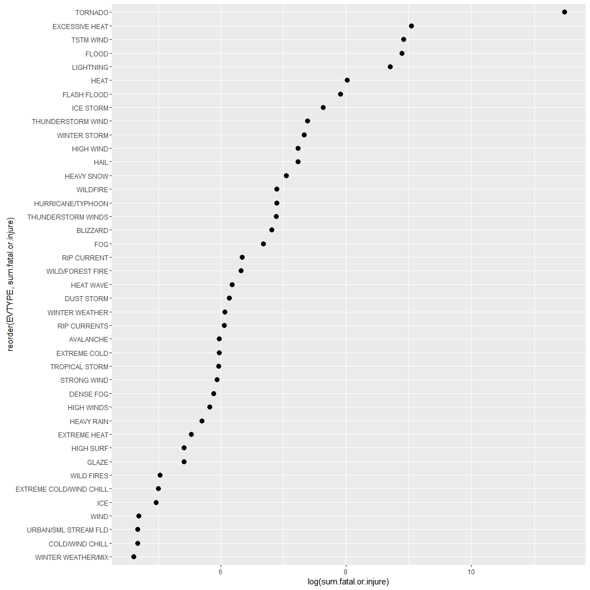

# NOAA_stormdata

## Synopsis

## Loading and Processing the Data


```r
library(lubridate)
library(ggplot2)
library(dplyr)
```

```
## 
## Attaching package: 'dplyr'
## 
## The following objects are masked from 'package:lubridate':
## 
##     intersect, setdiff, union
## 
## The following objects are masked from 'package:stats':
## 
##     filter, lag
## 
## The following objects are masked from 'package:base':
## 
##     intersect, setdiff, setequal, union
```

```r
library(data.table)
```

```
## 
## Attaching package: 'data.table'
## 
## The following objects are masked from 'package:dplyr':
## 
##     between, last
## 
## The following objects are masked from 'package:lubridate':
## 
##     hour, mday, month, quarter, wday, week, yday, year
```

```r
library(tidyr)
```

```
## Warning: package 'tidyr' was built under R version 3.2.3
```

```r
## loading for US State Facts and Figures
library(datasets)

if (!file.exists("./data")) {
    dir.create("./data")
}
```

Download, unzip, and read in the data.  


```r
fileurl <- "https://d396qusza40orc.cloudfront.net/repdata%2Fdata%2FStormData.csv.bz2"
download.file(fileurl, destfile = "./data/repdata%2Fdata%2FStormData.csv.bz2", mode = 'wb')

data <- read.csv("./data/repdata%2Fdata%2FStormData.csv.bz2", stringsAsFactors = FALSE)
```

Take a look at the data.


```r
str(data)
```

```
## 'data.frame':	902297 obs. of  37 variables:
##  $ STATE__   : num  1 1 1 1 1 1 1 1 1 1 ...
##  $ BGN_DATE  : chr  "4/18/1950 0:00:00" "4/18/1950 0:00:00" "2/20/1951 0:00:00" "6/8/1951 0:00:00" ...
##  $ BGN_TIME  : chr  "0130" "0145" "1600" "0900" ...
##  $ TIME_ZONE : chr  "CST" "CST" "CST" "CST" ...
##  $ COUNTY    : num  97 3 57 89 43 77 9 123 125 57 ...
##  $ COUNTYNAME: chr  "MOBILE" "BALDWIN" "FAYETTE" "MADISON" ...
##  $ STATE     : chr  "AL" "AL" "AL" "AL" ...
##  $ EVTYPE    : chr  "TORNADO" "TORNADO" "TORNADO" "TORNADO" ...
##  $ BGN_RANGE : num  0 0 0 0 0 0 0 0 0 0 ...
##  $ BGN_AZI   : chr  "" "" "" "" ...
##  $ BGN_LOCATI: chr  "" "" "" "" ...
##  $ END_DATE  : chr  "" "" "" "" ...
##  $ END_TIME  : chr  "" "" "" "" ...
##  $ COUNTY_END: num  0 0 0 0 0 0 0 0 0 0 ...
##  $ COUNTYENDN: logi  NA NA NA NA NA NA ...
##  $ END_RANGE : num  0 0 0 0 0 0 0 0 0 0 ...
##  $ END_AZI   : chr  "" "" "" "" ...
##  $ END_LOCATI: chr  "" "" "" "" ...
##  $ LENGTH    : num  14 2 0.1 0 0 1.5 1.5 0 3.3 2.3 ...
##  $ WIDTH     : num  100 150 123 100 150 177 33 33 100 100 ...
##  $ F         : int  3 2 2 2 2 2 2 1 3 3 ...
##  $ MAG       : num  0 0 0 0 0 0 0 0 0 0 ...
##  $ FATALITIES: num  0 0 0 0 0 0 0 0 1 0 ...
##  $ INJURIES  : num  15 0 2 2 2 6 1 0 14 0 ...
##  $ PROPDMG   : num  25 2.5 25 2.5 2.5 2.5 2.5 2.5 25 25 ...
##  $ PROPDMGEXP: chr  "K" "K" "K" "K" ...
##  $ CROPDMG   : num  0 0 0 0 0 0 0 0 0 0 ...
##  $ CROPDMGEXP: chr  "" "" "" "" ...
##  $ WFO       : chr  "" "" "" "" ...
##  $ STATEOFFIC: chr  "" "" "" "" ...
##  $ ZONENAMES : chr  "" "" "" "" ...
##  $ LATITUDE  : num  3040 3042 3340 3458 3412 ...
##  $ LONGITUDE : num  8812 8755 8742 8626 8642 ...
##  $ LATITUDE_E: num  3051 0 0 0 0 ...
##  $ LONGITUDE_: num  8806 0 0 0 0 ...
##  $ REMARKS   : chr  "" "" "" "" ...
##  $ REFNUM    : num  1 2 3 4 5 6 7 8 9 10 ...
```

```r
head(data)
```

```
##   STATE__           BGN_DATE BGN_TIME TIME_ZONE COUNTY COUNTYNAME STATE
## 1       1  4/18/1950 0:00:00     0130       CST     97     MOBILE    AL
## 2       1  4/18/1950 0:00:00     0145       CST      3    BALDWIN    AL
## 3       1  2/20/1951 0:00:00     1600       CST     57    FAYETTE    AL
## 4       1   6/8/1951 0:00:00     0900       CST     89    MADISON    AL
## 5       1 11/15/1951 0:00:00     1500       CST     43    CULLMAN    AL
## 6       1 11/15/1951 0:00:00     2000       CST     77 LAUDERDALE    AL
##    EVTYPE BGN_RANGE BGN_AZI BGN_LOCATI END_DATE END_TIME COUNTY_END
## 1 TORNADO         0                                               0
## 2 TORNADO         0                                               0
## 3 TORNADO         0                                               0
## 4 TORNADO         0                                               0
## 5 TORNADO         0                                               0
## 6 TORNADO         0                                               0
##   COUNTYENDN END_RANGE END_AZI END_LOCATI LENGTH WIDTH F MAG FATALITIES
## 1         NA         0                      14.0   100 3   0          0
## 2         NA         0                       2.0   150 2   0          0
## 3         NA         0                       0.1   123 2   0          0
## 4         NA         0                       0.0   100 2   0          0
## 5         NA         0                       0.0   150 2   0          0
## 6         NA         0                       1.5   177 2   0          0
##   INJURIES PROPDMG PROPDMGEXP CROPDMG CROPDMGEXP WFO STATEOFFIC ZONENAMES
## 1       15    25.0          K       0                                    
## 2        0     2.5          K       0                                    
## 3        2    25.0          K       0                                    
## 4        2     2.5          K       0                                    
## 5        2     2.5          K       0                                    
## 6        6     2.5          K       0                                    
##   LATITUDE LONGITUDE LATITUDE_E LONGITUDE_ REMARKS REFNUM
## 1     3040      8812       3051       8806              1
## 2     3042      8755          0          0              2
## 3     3340      8742          0          0              3
## 4     3458      8626          0          0              4
## 5     3412      8642          0          0              5
## 6     3450      8748          0          0              6
```

```r
summary(data)
```

```
##     STATE__       BGN_DATE           BGN_TIME          TIME_ZONE        
##  Min.   : 1.0   Length:902297      Length:902297      Length:902297     
##  1st Qu.:19.0   Class :character   Class :character   Class :character  
##  Median :30.0   Mode  :character   Mode  :character   Mode  :character  
##  Mean   :31.2                                                           
##  3rd Qu.:45.0                                                           
##  Max.   :95.0                                                           
##                                                                         
##      COUNTY       COUNTYNAME           STATE              EVTYPE         
##  Min.   :  0.0   Length:902297      Length:902297      Length:902297     
##  1st Qu.: 31.0   Class :character   Class :character   Class :character  
##  Median : 75.0   Mode  :character   Mode  :character   Mode  :character  
##  Mean   :100.6                                                           
##  3rd Qu.:131.0                                                           
##  Max.   :873.0                                                           
##                                                                          
##    BGN_RANGE          BGN_AZI           BGN_LOCATI       
##  Min.   :   0.000   Length:902297      Length:902297     
##  1st Qu.:   0.000   Class :character   Class :character  
##  Median :   0.000   Mode  :character   Mode  :character  
##  Mean   :   1.484                                        
##  3rd Qu.:   1.000                                        
##  Max.   :3749.000                                        
##                                                          
##    END_DATE           END_TIME           COUNTY_END COUNTYENDN    
##  Length:902297      Length:902297      Min.   :0    Mode:logical  
##  Class :character   Class :character   1st Qu.:0    NA's:902297   
##  Mode  :character   Mode  :character   Median :0                  
##                                        Mean   :0                  
##                                        3rd Qu.:0                  
##                                        Max.   :0                  
##                                                                   
##    END_RANGE          END_AZI           END_LOCATI       
##  Min.   :  0.0000   Length:902297      Length:902297     
##  1st Qu.:  0.0000   Class :character   Class :character  
##  Median :  0.0000   Mode  :character   Mode  :character  
##  Mean   :  0.9862                                        
##  3rd Qu.:  0.0000                                        
##  Max.   :925.0000                                        
##                                                          
##      LENGTH              WIDTH                F               MAG         
##  Min.   :   0.0000   Min.   :   0.000   Min.   :0.0      Min.   :    0.0  
##  1st Qu.:   0.0000   1st Qu.:   0.000   1st Qu.:0.0      1st Qu.:    0.0  
##  Median :   0.0000   Median :   0.000   Median :1.0      Median :   50.0  
##  Mean   :   0.2301   Mean   :   7.503   Mean   :0.9      Mean   :   46.9  
##  3rd Qu.:   0.0000   3rd Qu.:   0.000   3rd Qu.:1.0      3rd Qu.:   75.0  
##  Max.   :2315.0000   Max.   :4400.000   Max.   :5.0      Max.   :22000.0  
##                                         NA's   :843563                    
##    FATALITIES          INJURIES            PROPDMG       
##  Min.   :  0.0000   Min.   :   0.0000   Min.   :   0.00  
##  1st Qu.:  0.0000   1st Qu.:   0.0000   1st Qu.:   0.00  
##  Median :  0.0000   Median :   0.0000   Median :   0.00  
##  Mean   :  0.0168   Mean   :   0.1557   Mean   :  12.06  
##  3rd Qu.:  0.0000   3rd Qu.:   0.0000   3rd Qu.:   0.50  
##  Max.   :583.0000   Max.   :1700.0000   Max.   :5000.00  
##                                                          
##   PROPDMGEXP           CROPDMG         CROPDMGEXP       
##  Length:902297      Min.   :  0.000   Length:902297     
##  Class :character   1st Qu.:  0.000   Class :character  
##  Mode  :character   Median :  0.000   Mode  :character  
##                     Mean   :  1.527                     
##                     3rd Qu.:  0.000                     
##                     Max.   :990.000                     
##                                                         
##      WFO             STATEOFFIC         ZONENAMES            LATITUDE   
##  Length:902297      Length:902297      Length:902297      Min.   :   0  
##  Class :character   Class :character   Class :character   1st Qu.:2802  
##  Mode  :character   Mode  :character   Mode  :character   Median :3540  
##                                                           Mean   :2875  
##                                                           3rd Qu.:4019  
##                                                           Max.   :9706  
##                                                           NA's   :47    
##    LONGITUDE        LATITUDE_E     LONGITUDE_       REMARKS         
##  Min.   :-14451   Min.   :   0   Min.   :-14455   Length:902297     
##  1st Qu.:  7247   1st Qu.:   0   1st Qu.:     0   Class :character  
##  Median :  8707   Median :   0   Median :     0   Mode  :character  
##  Mean   :  6940   Mean   :1452   Mean   :  3509                     
##  3rd Qu.:  9605   3rd Qu.:3549   3rd Qu.:  8735                     
##  Max.   : 17124   Max.   :9706   Max.   :106220                     
##                   NA's   :40                                        
##      REFNUM      
##  Min.   :     1  
##  1st Qu.:225575  
##  Median :451149  
##  Mean   :451149  
##  3rd Qu.:676723  
##  Max.   :902297  
## 
```

start to explore the data, basic questions.


```r
length(unique(data$EVTYPE)) -> disaster.type.count
range(data$FATALITIES) -> max.death.count
range(data$INJURIES) -> max.injury.count

length(unique(data$STATE)) -> states.impacted.count
unique(data$STATE) -> states.impacted
setdiff(states.impacted, state.abb) -> impacted.outside.50.states
```

convert from data.frame to data.table.


```r
dt_data <- data.table(data)

## check for NA values
na.rows.injuries <- sum(is.na(dt_data$INJURIES))
na.rows.deaths <- sum(is.na(dt_data$FATALITIES))
```

Calculate: 
--The sum and averages of deaths and injuries by event type.
--Also calculate a total sum of fatal+injure by event type.
We can ignore property damage for now, this is not "population health".


```r
dt_data_sums <- dt_data[ ,.(sum.fatalities=sum(FATALITIES), avg.fatalities=mean(FATALITIES), 
         sum.injuries=sum(INJURIES), avg.injuries=mean(INJURIES), 
         sum.fatal.or.injure=sum(FATALITIES,INJURIES)),
         by=EVTYPE][order(-sum.fatal.or.injure)][sum.fatal.or.injure >= 100]
```

I filtered out rows of data < 100 combined injuries or fatalities.  There are misspelled EVTYPE labels 
and lables that don't all fit into 1 common heading, so land as a separate observation with 
no injuries or fatalities.  A perfect data set would combine in these misspelled EVTYPE labels
and other categories so that averages are correctly counted.  I am going to ignore this work
for this exercise, and only focus on the top most health harmful events.


```r
a <- ggplot(dt_data_sums, aes(log(sum.fatal.or.injure), reorder(EVTYPE,sum.fatal.or.injure))) +
                geom_point(size=3)
print(a)
```

 

I'd like to plot all of the data on the same plot, so I need to tidy the data.
Data is ordered by sum.fatal.or.injure.


```r
dt_data_sums %>% gather(type, count, -EVTYPE) -> tidy.data
nameorder <- tidy.data$EVTYPE[order(tidy.data[which(tidy.data$type == "sum.fatal.or.injure"),])]
tidy.data$EVTYPE <- factor(tidy.data$EVTYPE, levels = nameorder)
```

```
## Warning in `levels<-`(`*tmp*`, value = if (nl == nL) as.character(labels)
## else paste0(labels, : duplicated levels in factors are deprecated
```


```r
b <- ggplot(tidy.data, aes(log(count), EVTYPE)) + 
    geom_point(size=4, aes(colour=type))
print(b)
```

```
## Warning in `levels<-`(`*tmp*`, value = if (nl == nL) as.character(labels)
## else paste0(labels, : duplicated levels in factors are deprecated
```

```
## Warning in `levels<-`(`*tmp*`, value = if (nl == nL) as.character(labels)
## else paste0(labels, : duplicated levels in factors are deprecated
```

 

I love this dot plot!  Clearly, tornado by itself is on top for the fatality+injury metric.  
But I notice that "heat" is represented multiple times by different names.  I wonder what the 
data looks like if I combine rows for "heat", "wind", and "cold"?


```r
range(dt_data$PROPDMG) -> prop.damage.range
unique(dt_data$PROPDMGEXP) -> prop.damage.exp
range(dt_data$CROPDMG) -> crop.damage.range
unique(dt_data$CROPDMGEXP) -> crop.damage.exp
```

The exponent column is supposed to just have "B", "M", "K", or "H".  I'd like to do a quick
check on a few rows with the other values to figure out why they are there.


```r
dt_data_rows_wrong_exp <- dt_data[which(dt_data$PROPDMGEXP %in% 
                                            c("+", "5", "6", "?", "4", "2", "3", "7", "-")),]
```

Is there a notes section at the bottom of the data?  Why are numbers in the EXP column?


```r
tail(dt_data$PROPDMGEXP)
```

```
## [1] "K" "K" "K" "K" "K" "K"
```

```r
identical(crop.damage.exp, prop.damage.exp) -> notes.the.same
identical(dt_data$CROPDMGEXP, dt_data$PROPDMGEXP) -> col.notes.the.same
```

The remarks column has some notes on total damage estimates that match up with the
numbers in the EXP columns.  It appears these numeric values are due to rounding not to
3 significant figures, or just incorrect input of data.  


```r
print(prop.damage.exp)
```

```
##  [1] "K" "M" ""  "B" "m" "+" "0" "5" "6" "?" "4" "2" "3" "h" "7" "H" "-"
## [18] "1" "8"
```

```r
print(crop.damage.exp)
```

```
## [1] ""  "M" "K" "m" "B" "?" "0" "k" "2"
```

```r
prop.damage.exp.incorrect <- prop.damage.exp[!prop.damage.exp %in% 
                                                 c("K","M","B","m","h","H", "", "0")]

crop.damage.exp.incorrect <- crop.damage.exp[!crop.damage.exp %in% 
                                                 c("k","K","M","B","m","h","H", "", "0")]

prop.row.count.with.incorrect.exp <- nrow(dt_data[which(dt_data$PROPDMGEXP %in% 
                                                            prop.damage.exp.incorrect),])
crop.row.count.with.incorrect.exp <- nrow(dt_data[which(dt_data$CROPDMGEXP %in% 
                                                            crop.damage.exp.incorrect),])
```

98+8 rows with incorrect EXP values.

Calculate values just using PROPDMG and CROPDMG columns and keeping all rows.
I know this is not correct (missing mag multiplier), but I want to see the baseline data.
--The sum and averages of property and crop damage by event type.
--Also calculate a total sum of property+crop by event type.


```r
dt_data_econ_sums_no_mult <- dt_data[ ,.(sum.property=sum(PROPDMG), avg.property=mean(PROPDMG), 
                            sum.crop=sum(CROPDMG), avg.crop=mean(CROPDMG), 
                            sum.prop.or.crop=sum(PROPDMG,CROPDMG)),
                            by=EVTYPE][order(-sum.prop.or.crop)][sum.prop.or.crop >1500]

c <- ggplot(dt_data_econ_sums_no_mult, aes(log(sum.prop.or.crop), reorder(EVTYPE,sum.prop.or.crop))) +
    geom_point(size=3)
print(c)
```

 

Tornado damage is again on top, with flood, wind, and hail being the next highest.
This seems to make sense.  Heat is not at the top like it was for human health impact.

Now I am going to filter out the rows that contain incorrect "EXP" values.
Go back to original dt_data.


```r
dt_data_w_exp_rows_removed <- dt_data[which(!dt_data$PROPDMGEXP %in% 
                                           prop.damage.exp.incorrect),]
dt_data_w_exp_rows_removed <- dt_data_w_exp_rows_removed[which
                                            (!dt_data_w_exp_rows_removed$CROPDMGEXP %in% 
                                                crop.damage.exp.incorrect),]

print(unique(dt_data_w_exp_rows_removed$PROPDMGEXP))
```

```
## [1] "K" "M" ""  "B" "m" "0" "h" "H"
```

```r
print(unique(dt_data_w_exp_rows_removed$CROPDMGEXP))
```

```
## [1] ""  "M" "K" "m" "B" "0" "k"
```

Function to determine weekday and weekend
data.table reference generation and use of function


```r
exp.magnitude <- function(x) {
    ifelse(x == "K", 10^3,
    ifelse(x == "M", 10^6,
    ifelse(x == "" , 1,
    ifelse(x == "B", 10^9,
    ifelse(x == "m", 10^6,
    ifelse(x == "0" , 1,
    ifelse(x == "h", 10^2,
    ifelse(x == "H", 10^2, NA))))))))
}

dt_data_w_exp_rows_removed[ , prop.damage.multiplier := exp.magnitude(PROPDMGEXP)]
dt_data_w_exp_rows_removed[ , crop.damage.multiplier := exp.magnitude(CROPDMGEXP)]

dt_data_w_exp_rows_removed[ , prop.damage.total := prop.damage.multiplier*PROPDMG]
dt_data_w_exp_rows_removed[ , crop.damage.total := crop.damage.multiplier*CROPDMG]
dt_data_w_exp_rows_removed[ , damage.total := prop.damage.total+crop.damage.total]
```


```r
dt_data_econ <- dt_data_w_exp_rows_removed[ ,.(sum.property=sum(prop.damage.total), 
                                               avg.property=mean(prop.damage.total), 
                                         sum.crop=sum(crop.damage.total), 
                                         avg.crop=mean(crop.damage.total), 
                                         sum.prop.or.crop=sum(prop.damage.total, crop.damage.total)),
                                      by=EVTYPE][order(-sum.prop.or.crop)][sum.prop.or.crop >10000000]


d <- ggplot(dt_data_econ, aes(log(sum.prop.or.crop), reorder(EVTYPE,sum.prop.or.crop))) +
    geom_point(size=3)
print(d)
```

 

